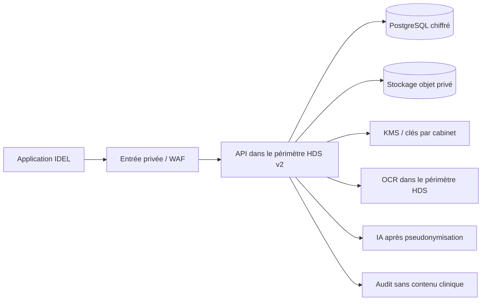

# Passage en production HDS v2

Statut au 12 août 2026 : **socle logiciel préparé, infrastructure réelle non provisionnée**.

Le site Vercel reste une vitrine et une démonstration exclusivement synthétique. L’API refuse de démarrer en mode `health` si le fournisseur, la référence de certificat et la région HDS ne sont pas explicitement déclarés. Elle refuse également ce mode avec une origine `vercel.app`.

## Architecture cible



## Conditions bloquantes avant le premier vrai dossier

- contrat signé avec un hébergeur présent dans la liste ANS et certificat HDS v2 contrôlé ;
- périmètre du certificat vérifié pour le calcul, PostgreSQL, stockage objet, sauvegardes, KMS et journaux ;
- réseau privé, TLS, chiffrement au repos, secrets hors dépôt et rotation testée ;
- sauvegarde chiffrée, restauration chronométrée et plan de continuité testés ;
- analyse de risques, registre RGPD, DPA, politique d’habilitation et procédure d’incident validés ;
- test d’intrusion et correction des vulnérabilités critiques/élevées ;
- aucun contenu patient dans les logs, outils analytics, e-mails ou observabilité hors périmètre.

## Variables de démarrage

```text
NODE_ENV=production
DATA_MODE=health
HDS_PROVIDER=<fournisseur contractualisé>
HDS_CERTIFICATE_REFERENCE=<référence du certificat HDS v2 contrôlé>
HDS_REGION=<région couverte>
```

Ces variables sont un garde-fou logiciel, pas une certification. La contractualisation et la vérification du périmètre restent obligatoires.

## Source officielle

- ANS, Hébergement des données de santé : https://esante.gouv.fr/ens/offre/hds
